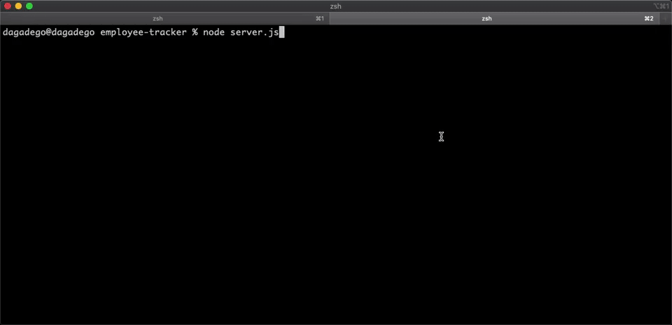

# 12 Employee Tracker
## Description
Manage your employee DB through your command line!
* Add employee, role, or department
* View employee, role, or department
* Update employee's role ID
## Table Of Contents
* [Screenshot](#screenshot)
* [Installation](#installation)
* [Usage](#usage)
* [Contributing](#contributing)
* [Credits](#credits)
* [Questions](#questions)
* [License](#license)
## Screenshot

## Installation
1. Make sure you have nodejs and npm installed on your local machine
1. Clone this repo onto your local machine
2. Open your command line and cd to the cloned folder
3. Run `npm install` to install all dependences
4. Go into the db folder `cd db`
5. Run `mysql -u root -p` then `source schema.sql` to create database and then `source seed.sql` to insert defined entries
4. Done! You're ready to use the app.
## Usage
`node server.js`
## Credits
* Maged Abdelsalam
## Questions
* Email me at hello@magedabdelsalam.com
* [magedabdelsalam](https://github.com/magedabdelsalam)
## License

